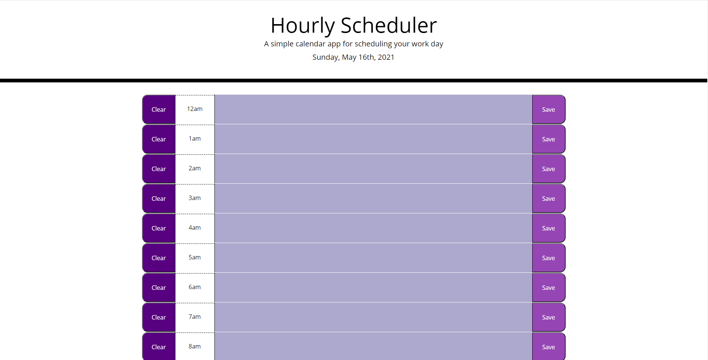

# Hourly-scheduler

## Description
  This hourly scheduler allow users to optimize their day by allowing for notetaking by the hour. It also shows you which hours have past, the current hour, and the hours left in the day. 

## Usage
To use this hourly scheduler is first navigate to [the site](https://millhouse36.github.io/hourlyScheduler/). Next, click on the textarea of the time you would like to save a note for, type in your note, hit save, and now your not is saved. if you would like to delete a note there is also a clear button to clear any note for a specific time. There is also restriction set up so users will not be able to make a note on an hour that has already passed. 

## Contributing to Budget-tracker  
To contribute to Budget-tracker , follow these steps:

1. Fork this repository.
2. Create a branch: `git checkout -b Hourly-scheduler `.
3. Make your changes and commit them: `git commit -m '<commit_message>'`
4. Push to the original branch: `git push origin Hourly-scheduler /<location>`
5. Create the pull request.

Alternatively see the GitHub documentation on [creating a pull request](https://help.github.com/en/github/collaborating-with-issues-and-pull-requests/creating-a-pull-request).

## Project status
Development of this projects has been halted with plans to covert this project into a full stack react application with user authentication.

## Host
https://millhouse36.github.io/hourlyScheduler/

## Author and Contact
If you have and questions contact me @
[Kevin Millhouse](https://github.com/MIllhouse36)
or [Email](https://millhousekevin@gmail.com)